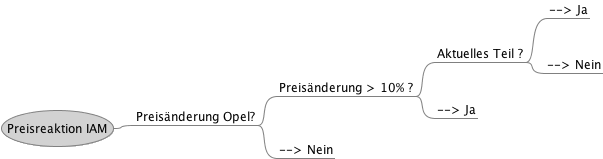

!SLIDE subsection
# Data Mining Methoden #
* Klassifikation: Entscheidungsbaeume
* Clusterverfahren
* Assoziationsanalyse: Warenkoerbe
* Sequenzanalyse

!SLIDE 
# Assoziationsanalyse #

!SLIDE center
# Clustering #

!SLIDE center
# Entscheidungsbäume #

!SLIDE subsection
# Beispiel #

